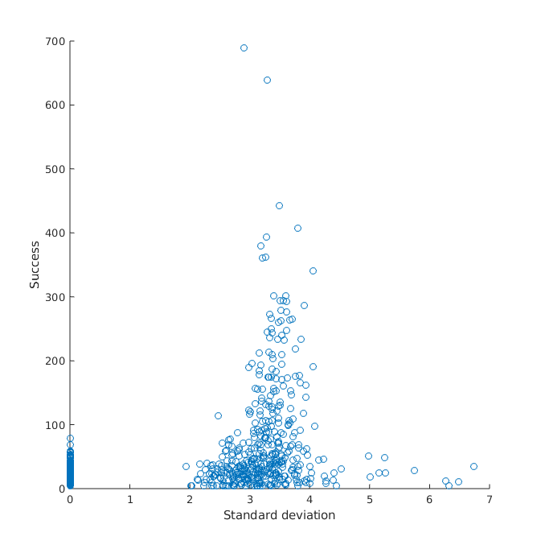
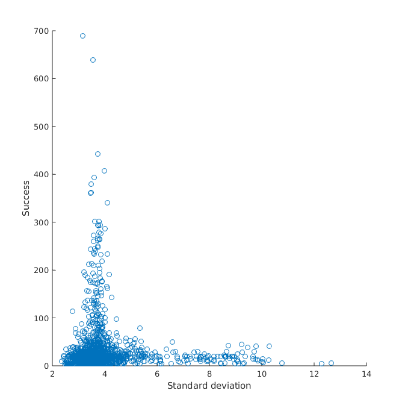
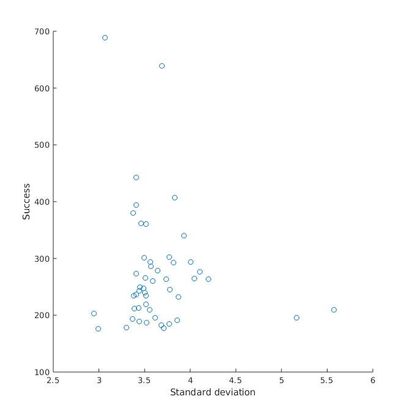
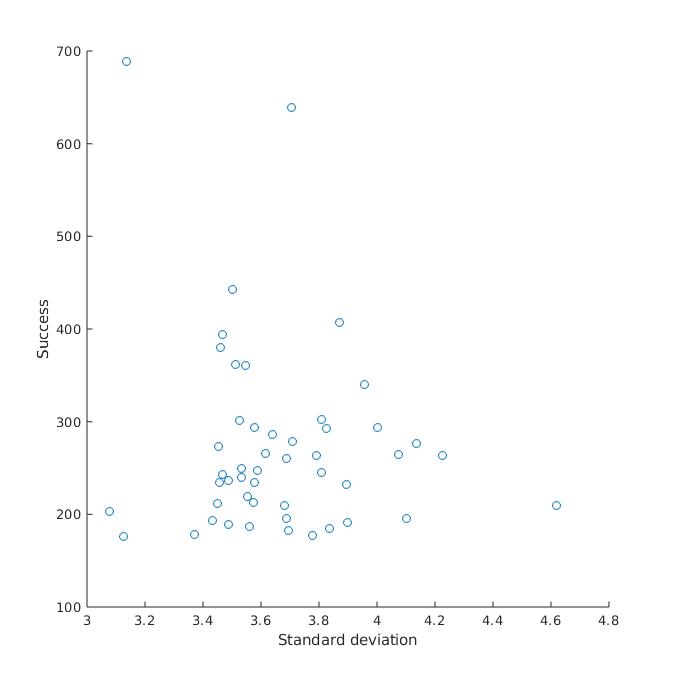
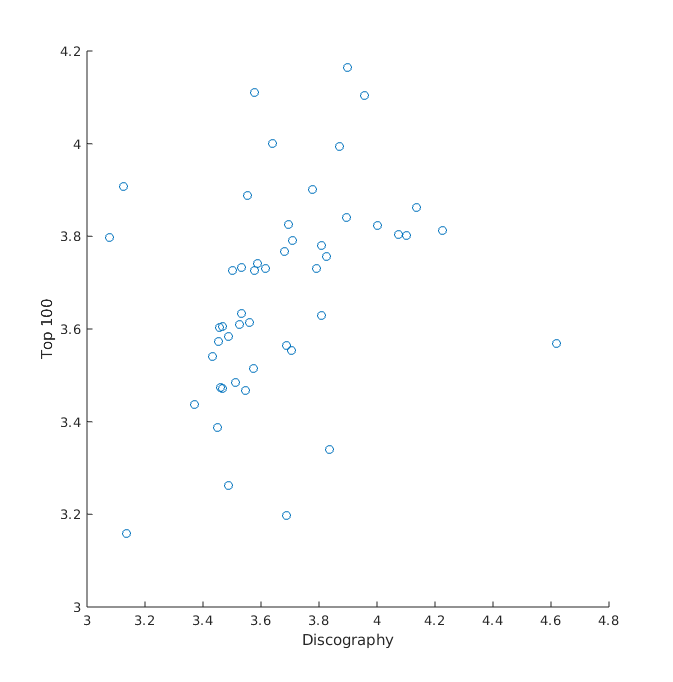
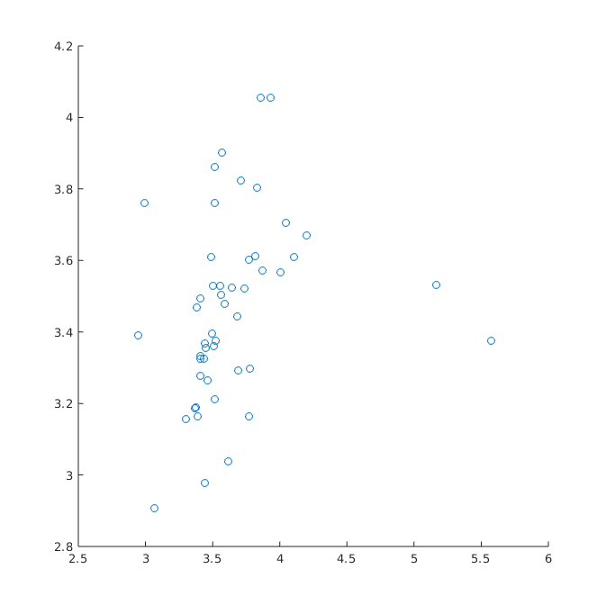

\tableofcontents

# Introduction

The aim of this project was to determine if there were any correlations
between a musician's success and the semantic mobility of their lyrics.

# Analysis

## Data sets

The data sets used for this analysis were two; the first dataset ("top100") was
obtained by collecting the author, title and lyrics of every song that was
featured on the weekly top 100 list maintained by the website "Billboard.com"
from 2009 to 2019, the second dataset ("discography") was obtained by 
collecting the data of every song released by the 50 artists that were 
featured most often on the top 100 chart. All lyrics were obtained using the 
API of the lyrics website "Genius.com".

The lyrics were filtered to remove non-English words and words that are not
very impactful to a song's meaning (e.g. articles like "the").

## Word2Vec

This analysis uses a Word2Vec model trained on Wikipedia pages to assign a
1000 dimensions vector to each word. The idea behind Word2Vec models is to
assign vectors to words in a way that places related words close to each other
and allows for meaningful semantic analysis.

## Semantic mobility

The calculation used to measure the semantic mobility of a given author is the
standard deviation as detailed below:

\begin{math}
	\sigma = \sqrt{\sum_{i=0}^{N}(r_i - c_i)^2}
\end{math}

where $r$ is the vector indicating the mean of all Word2Vec vectors in a given
song and $c$ is the center of mass or the mean of every song's mean vector.

## Success

An author's "success" is measured based on how many times they have been
featured on the weekly top 100 chart.

# Results

## Correlations

### Correlation between success and semantic mobility in "top100"

When $\sigma$ is calculated with separate $c$ values for each artist (meaning
$c$ is the mean of the means of all songs written by that artist) there is
a fairly strong positive correlation ($R = 0.4779$) between $\sigma$ and an
author's success with $P < 0.001$.

{width=50%}

However, when $c$ is calculated over the entire dataset (and therefore the same
for each artist) there is a much smaller negative correlation ($R = -0.0618$)
with $P < 0.05$.

{width=50%}

### Correlation between success and semantic mobility in "discography"

This correlation did not yield statistically significant results, possibly due
to the relatively small sample size.

{width=50%}
{width=50%}

### Correlation between semantic mobility in "top100" and "discography"

With $c$ calculated on all 50 artists there is a positive correlation
($R = 0.3311$) between an artist's mobility within the top 100 charts and their
mobility within their own discography with $P < 0.05$.

{width=50%}

Individually calculated $c$ values yielded no statistically significant
results.

{width=50%}

# Conclusions

The results don't paint a very clear picture; while highly successful artists
seem to have a higher semantic mobility when taken in isolation in the top 100
chart, that correlation is not present when considering the broader semantic
space of the charts or when taking those artists' entire discographies into
account. A possible explanation is that artists get more time under the
spotlight when they release songs that are markedly different from their
previous hits, however that would require a more detailed study to determine 
with certainty.

The direct comparison between hits and complete discographies seems to
confirm the idea that there is no relation between an artist's success and 
their overall semantic mobility but also that there is some relation between
their overall mobility and the mobility within their hits, possibly meaning
that artists tend to be consistently varied (or not varied) in their lyrics.

# Further developments

It would be interesting to analyze more closely the relationship between an
artist's hit songs and the rest of their output; do hits generally coincide 
with a significant change in semantic mobility?

Another interesting question would be how the semantic mobility of hits in the
last decade compares to previous decades, or even how each year compares to
previous years.
